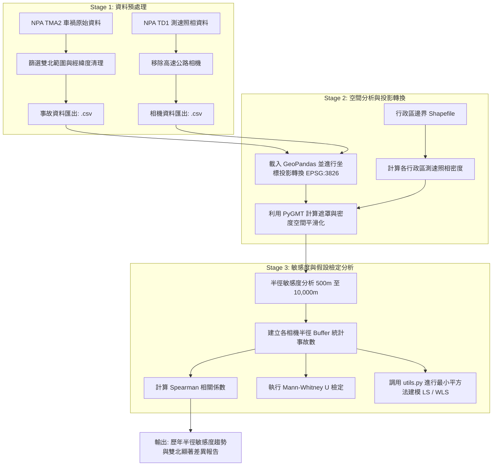

# 雙北市測速照相與車禍相關性探索分析 (EDA)
## Spatial Correlation Analysis between Speed Cameras and Traffic Accidents in Taipei & New Taipei City

---

> [!NOTE]
> ### 專案目標 (Project Objective)
>
> **[中文]**
> 本專案旨在透過探索性資料分析（EDA）探討臺北市與新北市自民國 110 年至 113 年間，測速照相機設置密度與道路車禍發生密度之間的空間相關性。藉由在不同空間搜尋半徑（500公尺至 10,000公尺）下進行敏感度分析，並結合統計檢定（如 Spearman 相關係數、Mann-Whitney U 檢定與最小平方法線性回歸），驗證測速照相機的設置密度與車禍分布是否存在統計上的顯著關係。
>
> **[English]**
> This project aims to perform an Exploratory Data Analysis (EDA) to investigate the spatial correlation between the density of speed enforcement cameras and traffic accidents in Taipei and New Taipei City from Year 110 to 113. By performing sensitivity analysis across different spatial search radii (ranging from 500m to 10,000m) and utilizing statistical approaches (e.g., Spearman correlation coefficient, Mann-Whitney U test, and Least Squares linear regression), we examine whether speed cameras have a statistically significant relationship with traffic accident distributions.

---

## 🗺️ 空間分析工作流流程圖 (Spatial Analysis Flowchart)

以下為本專案資料處理、空間計算與統計檢定的核心工作流：



---

## 🧮 核心演算法與虛擬碼 (Algorithms & Pseudocode)

### 1. 空間半徑敏感度與相關性分析演算法
該演算法旨在探討在何種空間尺度（搜尋半徑 $r$）下，測速照相密度與車禍發生密度的關聯性最強。

**數學原理：**
對於每個搜尋半徑 $r \in [500\text{m}, 10000\text{m}]$（步長 $\Delta r = 1000\text{m}$）：
1. 以每個測速相機 $S_i$ 的投影坐標為圓心，建立半徑為 $r$ 的空間緩衝區（Buffer） $B(S_i, r)$。
2. 統計落在該緩衝區內的車禍事故總數 $N(S_i, r)$。
3. 計算各相機的測速照相密度與其周邊車禍數 $N(S_i, r)$ 之間的 Spearman 無母數等級相關係數 $\rho_r$：
   $$\rho = 1 - \frac{6 \sum d_i^2}{n(n^2 - 1)}$$

**演算法虛擬碼 (Pseudocode)：**
```python
Algorithm: Spatial_Sensitivity_Correlation
Input: 
    Cameras: GeoDataFrame of speed cameras with geometry (TWD97)
    Accidents: GeoDataFrame of car accidents with geometry (TWD97)
    radii_list: List of test radii (e.g., [500, 1500, ..., 9500])
Output: 
    correlation_results: Table of correlation coefficients for each radius

Initialize correlation_results as empty list
For each radius r in radii_list:
    Initialize accident_counts_at_radius as empty list
    For each camera C in Cameras:
        Create buffer_geometry B = C.geometry.buffer(r)
        Find all accidents A where A.geometry is within B
        Count = length of A
        Append Count to accident_counts_at_radius
    
    Calculate Spearman correlation coefficient (rho) and p_value between:
        - Cameras.point_count (Speed camera local density)
        - accident_counts_at_radius
    
    Append (r, rho, p_value) to correlation_results
Return correlation_results
```

---

### 2. 最小平方法線性回歸演算法 (Least Squares, LS & WLS)
用於建立測速照相密度與車禍密度的線性響應模型。封裝於 `utils.py` 中。

**數學模型：**
線性觀測方程為 $d = G m + e$，其中 $G$ 為設計矩陣（包含截距項與照相密度），$d$ 為車禍數觀測向量，$m$ 為模型參數。
* **普通最小平方法 (LS)** 求解公式：
  $$\hat{m}_{LS} = (G^T G)^{-1} G^T d$$
* **加權最小平方法 (WLS)** 求解公式（引入權重矩陣 $W$ 以解決異質變異問題）：
  $$\hat{m}_{WLS} = (G^T W G)^{-1} G^T W d$$

**演算法虛擬碼 (Pseudocode - WLS)：**
```python
Algorithm: Solve_Weighted_Least_Squares (solveWLS)
Input: 
    G: Design matrix (n x p)
    d: Observation vector (n x 1)
    W: Weight matrix (n x n)
Output: 
    m: Parameter vector (p x 1)
    RSS: Weighted residual sum of squares
    residual_variance: Degrees of freedom corrected variance

Calculate matrix_product = Transpose(G) @ W @ G
Calculate inverse_product = Inverse(matrix_product)
Calculate m = inverse_product @ Transpose(G) @ W @ d

Calculate residuals e = d - G @ m
Calculate RSS = Sum(e_i^2 * W_ii)
Calculate DOF = length(d) - length(m)
Calculate residual_variance = RSS / DOF

Return m, RSS, residual_variance
```

---

### 3. Mann-Whitney U 統計假說檢定 (MWU Test)
用於檢定臺北市與新北市在相同的搜尋半徑下，其相機周邊車禍分布是否具有統計上的顯著差異。

**統計假說：**
* 虛無假說 $H_0$：臺北市與新北市的相機周邊車禍分布無顯著差異。
* 對立假說 $H_1$：雙北市的分布具有顯著的空間分布差異。
當 $P\text{-value} < \alpha\ (0.05)$ 時，拒絕虛無假說，認為雙北在該搜尋尺度下的執法效能或交通環境有顯著差異。

---

## 🛠️ 專案工作流與檔案說明 (Project Workflow & Files)

專案包含多個 Jupyter Notebook，請依以下順序執行以完成完整的分析流程：

| 執行順序 | 檔案名稱 | 核心職責與分析內容 | 輸出產物 |
| :---: | :--- | :--- | :--- |
| **1** | [Final_project_dataprocess.ipynb](file:///c:/Users/nianz/Desktop/University/114-2/%E8%B3%87%E6%96%99%E7%A7%91%E5%AD%B8/final%20project/Final_project_dataprocess.ipynb) | **資料預處理**：讀取並合併歷年內政部警政署車禍資料 (NPA TMA2)，篩選出臺北市與新北市之事故經緯度與時間。 | `Taipei_NewTaipei_accident.csv` |
| **2** | [Final_project_pygmt.ipynb](file:///c:/Users/nianz/Desktop/University/114-2/%E8%B3%87%E6%96%99%E7%A7%91%E5%AD%B8/final%20project/Final_project_pygmt.ipynb) | **空間分析與製圖**：載入測速照相資料，結合行政區邊界 Shapefile。利用 `pygmt` 計算臺北市遮罩並將測速照相密度平滑化，繪製高品質空間分布圖。 | 5 張地理空間分布圖表 |
| **3** | [Final_project_python.ipynb](file:///c:/Users/nianz/Desktop/University/114-2/%E8%B3%87%E6%96%99%E7%A7%91%E5%AD%B8/final%20project/Final_project_python.ipynb) | **臺北市歷年相關性分析**：計算 110-113 年臺北市測速照相密度與車禍發生密度之 Spearman 相關係數。針對 500m 至 10,000m 之搜尋半徑進行敏感度分析。 | 歷年半徑敏感度趨勢圖 |
| **4** | [Final_project_python_compare.ipynb](file:///c:/Users/nianz/Desktop/University/114-2/%E8%B3%87%E6%96%99%E7%A7%91%E5%AD%B8/final%20project/Final_project_python_compare.ipynb) | **雙北市對比分析**：合併臺北市與新北市的數據，分析兩直轄市在不同搜尋半徑下的相關係數變化與空間趨勢差異。 | 雙北市對比分析圖表 |
| **5** | [Final_project_python_compare_MWU_test.ipynb](file:///c:/Users/nianz/Desktop/University/114-2/%E8%B3%87%E6%96%99%E7%A7%91%E5%AD%B8/final%20project/Final_project_python_compare_MWU_test.ipynb) | **假設檢定 (顯著性分析)**：採用 Mann-Whitney U 檢定 (MWU Test) 驗證雙北在不同半徑下的數據分布是否存在顯著的統計學差異。 | 統計檢定結果與顯著性分析圖 |
| **-** | [utils.py](file:///c:/Users/nianz/Desktop/University/114-2/%E8%B3%87%E6%96%99%E7%A7%91%E5%AD%B8/final%20project/utils.py) | **數學計算工具**：封裝最小平方法 (`solveLS`) 與加權最小平方法 (`solveWLS`) 的矩陣計算函式。 | 核心演算法支援 |

---

## 📊 資料來源 (Data Sources)

* **測速照相機位置資料**：內政部警政署開放資料 (NPA TD1)
* **道路交通事故資料**：內政部警政署 A1/A2 類道路交通事故資料 (NPA TMA2)
* **行政區域邊界資料**：內政部國土測繪中心臺灣行政區域界線圖 (Shapefile)

---

## 💻 環境需求與安裝 (Requirements & Installation)

本專案使用 Python 進行地理空間資訊處理與統計分析，主要依賴套件如下：

* **科學計算與資料處理**：`numpy`, `pandas`, `scipy`
* **空間地理資訊處理 (GIS)**：`geopandas`, `shapely`, `pygmt` (Generic Mapping Tools)
* **數據視覺化**：`matplotlib`, `pygmt`

> [!TIP]
> 建議使用 Anaconda 環境，並使用 `conda` 安裝 `pygmt` 以確保相依套件 (GMT) 的正確配置：
> ```bash
> conda create -n dscp_env -c conda-forge python=3.10 pygmt geopandas pandas scipy matplotlib
> ```
