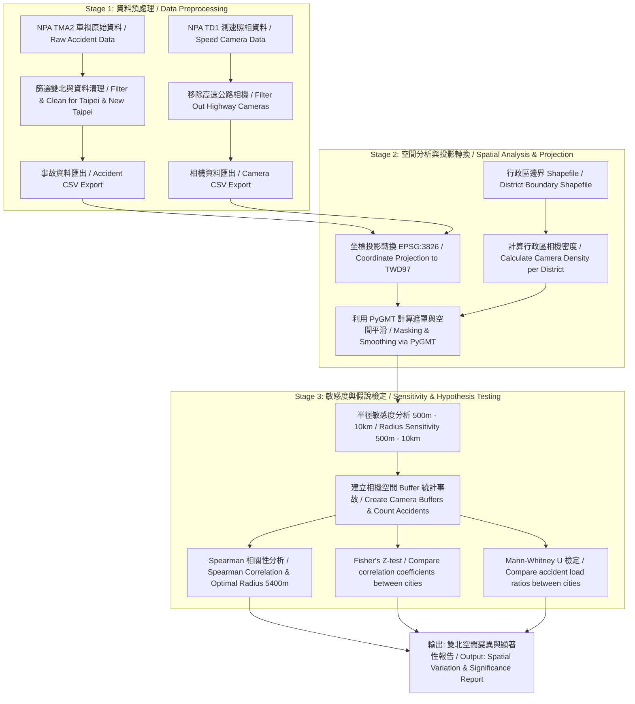

# 雙北市測速照相與車禍相關性探索分析 (EDA)
## Spatial Correlation Analysis between Speed Cameras and Traffic Accidents in Taipei & New Taipei City

---

> [!NOTE]
> ### 專案目標 (Project Objective)
>
> **[中文]**
> 本專案旨在透過探索性資料分析（EDA）探討臺北市與新北市自民國 110 年至 113 年間，測速照相機設置密度與道路車禍發生密度之間的空間相關性。藉由在不同空間搜尋半徑（500公尺至 10,000公尺）下進行敏感度分析，並結合統計檢定（如 Spearman 相關係數、Fisher's Z-test 與 Mann-Whitney U 檢定），驗證測速照相機的設置密度與車禍分布是否存在統計上的顯著關係。
>
> **[English]**
> This project aims to perform an Exploratory Data Analysis (EDA) to investigate the spatial correlation between the density of speed enforcement cameras and traffic accidents in Taipei and New Taipei City from Year 110 to 113. By performing sensitivity analysis across different spatial search radii (ranging from 500m to 10,000m) and utilizing statistical approaches (e.g., Spearman correlation coefficient, Fisher's Z-test, and Mann-Whitney U test), we examine whether speed cameras have a statistically significant relationship with traffic accident distributions.

---

## 🗺️ 空間分析工作流流程圖 (Spatial Analysis Flowchart)

以下為本專案資料處理、空間計算與統計檢定的核心工作流：
The following is the core workflow of data processing, spatial calculation, and statistical testing in this project:



---

## 🧮 核心演算法與統計檢定 / Core Algorithms & Statistical Tests

### 1. 空間半徑敏感度與相關性分析演算法 / Spatial Radius Sensitivity & Correlation Algorithm
該演算法旨在探討在何種空間尺度（搜尋半徑 $r$）下，測速照相密度與車禍發生密度的關聯性最強。
This algorithm investigates the spatial scale (search radius $r$) at which the correlation between speed camera density and accident density is strongest.

* **[中文] 數學原理：**
  對於每個搜尋半徑 $r \in [500\text{m}, 10000\text{m}]$：
  1. 以每個測速相機 $S_i$ 的投影坐標為圓心，建立半徑為 $r$ 的空間緩衝區 (Buffer) $B(S_i, r)$。
  2. 統計落在該緩衝區內的車禍事故總數 $N(S_i, r)$。
  3. 計算各相機的測速照相密度與其周邊車禍數 $N(S_i, r)$ 之間的 Spearman 等級相關係數 $\rho_r$。
  **分析結果**：臺北市自 110 至 113 年，最優相關係數對應之搜尋半徑皆為 **5,400公尺 (5.4 km)**：
  * 民國 110 年：ρ = 0.672，P-value = 3.99e-11
  * 民國 111 年：ρ = 0.690，P-value = 6.96e-12
  * 民國 112 年：ρ = 0.684，P-value = 1.26e-11
  * 民國 113 年：ρ = 0.700，P-value = 2.53e-12
* **[English] Mathematical Principle:**
  For each search radius $r \in [500\text{m}, 10000\text{m}]$:
  1. Centered on the projected coordinates of each speed camera $S_i$, establish a spatial buffer $B(S_i, r)$ with radius $r$.
  2. Count the total number of traffic accidents $N(S_i, r)$ falling within the buffer.
  3. Calculate the Spearman rank correlation coefficient $\rho_r$.
  **Analysis Results**: The optimal radius for the strongest correlation in Taipei is consistently **5,400m** from Yr 110 to 113.
  * Yr 110: ρ = 0.672, P = 3.99e-11
  * Yr 111: ρ = 0.690, P = 6.96e-12
  * Yr 112: ρ = 0.684, P = 1.26e-11
  * Yr 113: ρ = 0.700, P = 2.53e-12

**演算法虛擬碼 / Algorithm Pseudocode:**
```python
Algorithm: Spatial_Sensitivity_Correlation
Input: 
    Cameras: GeoDataFrame of speed cameras with geometry (TWD97)
    Accidents: GeoDataFrame of car accidents with geometry (TWD97)
    radii_list: List of test radii (e.g., [500, 1500, ..., 9500])
Output: 
    correlation_results: Table of correlation coefficients for each radius

Initialize correlation_results as empty list
For each radius r in radii_list:
    Initialize accident_counts_at_radius as empty list
    For each camera C in Cameras:
        Create buffer_geometry B = C.geometry.buffer(r)
        Find all accidents A where A.geometry is within B
        Count = length of A
        Append Count to accident_counts_at_radius
    
    Calculate Spearman correlation coefficient (rho) and p_value between:
        - Cameras.point_count (Speed camera local density)
        - accident_counts_at_radius
    
    Append (r, rho, p_value) to correlation_results
Return correlation_results
```

---

### 2. Fisher's Z-test 相關係數比較檢定 / Fisher's Z-test for Comparing Correlations
用於檢定臺北市與新北市在相同的搜尋半徑下，其測速照相與車禍數的相關係數是否存在顯著差異。
Used to test whether the correlation coefficients of Taipei and New Taipei City differ significantly under the same search radius.

* **[中文] 統計方法：**
  分別計算雙北的等級相關係數 $r_1, r_2$，透過 Fisher r-to-z 轉換將其轉為近似常態分布之 Z 值後，進行雙尾 Z 檢定。
  **結論**：在絕大多數空間半徑下，P-value >= 0.05，表示雙北相關性無顯著差異，兩市相關性表現高度一致。
* **[English] Statistical Approach:**
  Apply Fisher r-to-z transformation to the coefficients $r_1, r_2$ of both cities to calculate Z-scores and test their significance.
  **Conclusion**: In most radii, P-value >= 0.05, suggesting no significant difference in correlations between the two cities.

---

### 3. Mann-Whitney U 事故負荷比檢定 / Mann-Whitney U Test on Accident Load Ratio
用於檢定臺北市與新北市在相同的搜尋半徑下，其「事故負荷比」分布是否具有統計上的顯著差異。
Used to test whether the "Accident Load Ratio" distributions around cameras in Taipei and New Taipei City differ significantly under the same search radius.

* **[中文] 負荷比定義與檢定：**
  * 事故負荷比 (Accident Load Ratio) = `一定半徑內事故數 ÷ 該半徑內測速照相總數`。
  * 由於負荷比數據為偏態且富含極端值，採用無母數的 Mann-Whitney U 檢定。
  * 虛無假說 $H_0$：雙北的相機事故負荷比無顯著差異；對立假說 $H_1$：雙北的事故負荷比分布具有顯著差異。
  * **分析結果**：在 **9.5公里** 搜尋半徑下，**臺北市的事故負荷比顯著小於新北市** (P-value < 0.05)，拒絕 $H_0$。
* **[English] Load Ratio & Testing:**
  * Accident Load Ratio = `accidents within radius ÷ speed cameras in that radius`.
  * Since load ratio data is non-normally distributed, the non-parametric Mann-Whitney U test is applied.
  * **Analysis Results**: Under a **9.5km** radius, **Taipei's accident load ratio is statistically smaller than New Taipei City's** (P-value < 0.05), rejecting $H_0$.

---

## 🛠️ 專案工作流與檔案說明 / Project Workflow & Files

專案包含多個 Jupyter Notebook，請依以下順序執行以完成完整的分析流程：
Please execute the Jupyter Notebooks in the following order to complete the analysis pipeline:

| 執行順序 / Order | 檔案名稱 / Filename | 核心職責與分析內容 (Bilingual) | 輸出產物 / Output |
| :---: | :--- | :--- | :--- |
| **1** | [Final_project_dataprocess.ipynb](file:///c:/Users/nianz/Desktop/University/114-2/%E8%B3%87%E6%96%99%E7%A7%91%E5%AD%B8/final%20project/Final_project_dataprocess.ipynb) | **資料預處理 (Data Preprocessing)**：<br>• [中] 讀取並合併歷年內政部警政署車禍資料 (NPA TMA2)，篩選出雙北事故。<br>• [Eng] Merge raw NPA TMA2 accident data, filtering coordinates for Taipei and New Taipei City. | `Taipei_NewTaipei_accident.csv` |
| **2** | [Final_project_pygmt.ipynb](file:///c:/Users/nianz/Desktop/University/114-2/%E8%B3%87%E6%96%99%E7%A7%91%E5%AD%B8/final%20project/Final_project_pygmt.ipynb) | **空間分析與製圖 (Spatial Analysis & Mapping)**：<br>• [中] 結合行政區邊界 Shapefile，利用 `pygmt` 將測速相機密度空間平滑化與屏蔽遮罩繪圖。<br>• [Eng] Utilize `pygmt` with boundary Shapefile to smoothly interpolate speed camera density and plot. | 5 張地理空間圖表 / 5 Spatial Maps |
| **3** | [Final_project_python.ipynb](file:///c:/Users/nianz/Desktop/University/114-2/%E8%B3%87%E6%96%99%E7%A7%91%E5%AD%B8/final%20project/Final_project_python.ipynb) | **臺北市歷年相關性分析 (Taipei Correlation Analysis)**：<br>• [中] 計算 110-113 年台北市測速密度與車禍 Spearman 相關係數，進行半徑敏感度分析 (500m-10km)。指出最優半徑為 5,400m。<br>• [Eng] Compute Spearman correlation in Taipei (110-113) and conduct sensitivity analysis (500m-10km), finding the optimal radius at 5,400m. | 歷年半徑敏感度趨勢圖 / Radii Trend Charts |
| **4** | [Final_project_python_compare.ipynb](file:///c:/Users/nianz/Desktop/University/114-2/%E8%B3%87%E6%96%99%E7%A7%91%E5%AD%B8/final%20project/Final_project_python_compare.ipynb) | **雙北市對比分析 (Taipei vs New Taipei Comparison)**：<br>• [中] 合併雙北市數據，分析兩直轄市在不同搜尋半徑下的相關係數變化與趨勢對照，執行 Fisher's Z-test。<br>• [Eng] Compare spatial correlation variations and coefficient trends between the two major cities using Fisher's Z-test. | 雙北對比圖表 / Comparative Charts |
| **5** | [Final_project_python_compare_MWU_test.ipynb](file:///c:/Users/nianz/Desktop/University/114-2/%E8%B3%87%E6%96%99%E7%A7%91%E5%AD%B8/final%20project/Final_project_python_compare_MWU_test.ipynb) | **事故負荷比假設檢定 (MWU Hypothesis Testing)**：<br>• [中] 採用 Mann-Whitney U 檢定驗證雙北在不同半徑下的「事故負荷比」分布是否存在顯著統計學差異。<br>• [Eng] Conduct Mann-Whitney U test to check statistical significance of differences in accident load ratios between cities. | 統計檢定結果圖 / MWU Test Visuals |
| **-** | [utils.py](file:///c:/Users/nianz/Desktop/University/114-2/%E8%B3%87%E6%96%99%E7%A7%91%E5%AD%B8/final%20project/utils.py) | **數學計算工具 (Matrix Calculations)**：<br>• [中] 支援普通最小平方法 (`solveLS`) 與加權最小平方法 (`solveWLS`) 矩陣運算。<br>• [Eng] Contain functions for solving Ordinary Least Squares (LS) and Weighted Least Squares (WLS). | 核心演算法支援 / Helper Library |

---

## 📊 資料來源 / Data Sources

* **測速照相機位置資料 / Speed Camera Locations**: 內政部警政署開放資料 (NPA TD1)
* **道路交通事故資料 / Traffic Accidents**: 內政部警政署 A1/A2 類道路交通事故資料 (NPA TMA2)
* **行政區域邊界資料 / Administrative Boundaries**: 內政部國土測繪中心臺灣行政區域界線圖 (Shapefile)

---

## 💻 環境需求與安裝 / Requirements & Installation

* **科學計算與資料處理 / Computing**: `numpy`, `pandas`, `scipy`
* **空間地理資訊處理 / Spatial (GIS)**: `geopandas`, `shapely`, `pygmt` (Generic Mapping Tools)
* **數據視覺化 / Visualization**: `matplotlib`, `pygmt`

> [!TIP]
> 建議使用 Anaconda 環境，並使用 `conda` 安裝 `pygmt` 以確保相依套件 (GMT) 的正確配置：
> We recommend building an Anaconda environment and installing `pygmt` via `conda-forge`:
> ```bash
> conda create -n dscp_env -c conda-forge python=3.10 pygmt geopandas pandas scipy matplotlib
> ```
